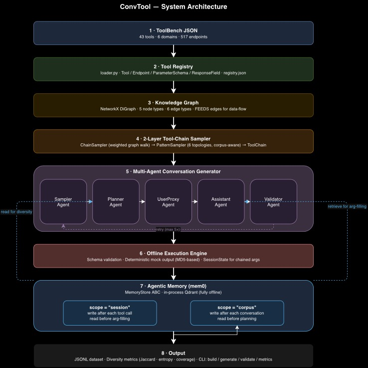

# Design Document — ConvTool

## Overview

Tool-use AI agents are increasingly important in enterprise software contexts: they need to select the right API from a large catalogue, fill arguments correctly, chain multiple calls in sequence, and handle clarification when the user's intent is underspecified. Building and evaluating such agents requires high-quality training data, but collecting real multi-step tool-use conversations at scale is expensive and often impractical due to data privacy constraints.

ConvTool addresses this by generating synthetic training conversations entirely offline, grounded in actual API schemas from ToolBench. The core design principle is that every aspect of a generated conversation — which tools are called, in what order, with what arguments — must be derivable from the schema graph rather than hardcoded. This ensures that the system generalises to new tool registries without code changes.

The architecture has five layers: a schema-normalising registry, a knowledge graph, a 2-layer graph sampler, a multi-agent conversation generator, and an agentic memory system. Each layer's design is explained below.



---

## 1. Tool Registry

### Normalising ToolBench Schemas

ToolBench JSON files are not uniformly structured. Fields like `required_parameters`, `body`, and `schema` vary significantly across tools — some are missing entirely, some have wrong types, and some use placeholder values. A loader that assumes clean input would fail silently or crash on real data.

The registry loader (`registry/loader.py`) handles 15+ distinct inconsistency patterns explicitly: treating `None` parameter lists as empty, falling back across multiple possible name fields, detecting placeholder response bodies, and per-entry exception isolation so a single malformed endpoint does not abort an entire tool file. Every tool and endpoint is represented as a frozen `dataclass`, making the registry immutable after construction. This prevents accidental mutation during graph building or sampling.

### Why Frozen Dataclasses

Using frozen dataclasses (rather than dicts or mutable objects) has two practical benefits. First, the registry can be serialised to JSON and deserialised with `from_dict` without any schema drift — the data model and the serialisation format stay in sync automatically. Second, `ToolRegistry.get_tool()` and `get_endpoint()` use lazily built dict indices, giving O(1) lookup while keeping the primary storage as an ordinary list for JSON round-trips.

---

## 2. Knowledge Graph

### Why a Directed Property Graph

Tool-use conversations are relational: a `book_hotel` call depends on a `hotel_id` that was returned by a prior `search_hotels` call, and both tools belong to the "accommodation" semantic domain. A flat tool registry can store this information but cannot query it. A directed property graph can: traversal over `FEEDS` edges directly answers the question "which tools can follow this one, given data-flow compatibility?" without any hardcoded routing logic.

NetworkX `DiGraph` was chosen over a dedicated graph database because:
1. It runs entirely in-process — reviewers and CI pipelines have no infrastructure setup.
2. The graph lives only as long as the process, which is appropriate for a generation-time artifact.
3. `DiGraph` supports all required traversal operations: `successors()`, `predecessors()`, attribute filtering, in-degree queries.

The choice is practical rather than aspirational. In a production system at scale, a persistent graph store (Neo4j, Amazon Neptune) would be appropriate; for this offline data generation use case, in-process is the right trade-off.

### Graph Schema

```
Node types:
    Tool          — name, description, category
    Endpoint      — callable unit with method and URL
    Parameter     — input field of an endpoint (type, required, enum, default)
    ResponseField — output field of an endpoint
    ConceptTag    — semantic tag derived from tool name and category

Edge types:
    HAS_ENDPOINT   Tool       → Endpoint
    TAKES_PARAM    Endpoint   → Parameter
    RETURNS_FIELD  Endpoint   → ResponseField
    TAGGED_AS      Tool       → ConceptTag
    CO_OCCURS      ConceptTag ↔ ConceptTag  (same-tool co-occurrence, bidirectional)
    FEEDS          Endpoint   → Endpoint    (data-flow: output field name matches required param name)
```

### FEEDS Edges

After ingestion, a post-processing pass adds `FEEDS` edges. The rule is simple: Endpoint A feeds Endpoint B if A has a `ResponseField` whose name matches a required `Parameter` of B. This is a name-based heuristic — it catches common patterns like `hotel_id`, `latitude`/`longitude`, `city` — without requiring any manual annotation. The sampler uses these edges to prefer data-flow-compatible chains over arbitrary sequences, which is what makes the generated conversations feel like realistic workflows rather than random API calls.

---

## 3. Sampler Design

The sampler is split into two layers because the two decisions it makes — *which* tools to include and *how* they are structured — have different information requirements and should be independently testable.

### Layer 1 — ChainSampler (`graph/sampler.py`)

ChainSampler builds a tool-level projection from the full knowledge graph: one node per tool, edges derived from `FEEDS` (weight 2.0) and shared `ConceptTag` (weight 1.0). It then performs a weighted random walk starting from source nodes (tools with in-degree zero, which are natural conversation starters since nothing feeds them) and samples the next tool proportional to edge weight at each step.

Weighting `FEEDS` edges twice as heavily as `tag_overlap` edges reflects a deliberate choice: data-flow compatibility is more informative than semantic proximity for determining a realistic tool sequence. Two finance tools sharing the "finance" concept tag does not imply that one should follow the other; but if tool A's output contains a `symbol` field that tool B requires as input, that is a concrete dependency.

At dead ends (no unvisited successors), the walk falls back to any unvisited tool in the same domain, maintaining thematic coherence without getting stuck. A domain coherence check rejects walks where tools are from mismatched domains (e.g., a food API appearing in a location chain) and retries up to 5 times before accepting the best available walk.

### Layer 2 — PatternSampler (`graph/patterns.py`)

PatternSampler receives the ordered tool list from ChainSampler and determines the conversation topology. Six patterns are supported:

| Pattern | Structure | Default weight |
|---|---|---|
| `linear` | A→B→C (3–5 steps) | 30% |
| `pipeline` | A→B→C→D→E (4–5 steps) | 20% |
| `fan_out` | A→B and A→C independently | 15% |
| `fan_in` | A and B independently→C | 15% |
| `diamond` | A→{B,C}→D | 10% |
| `conditional` | A→B→C, branch at A's result | 10% |

Default weights reflect the intuition that sequential patterns are more common in real enterprise workflows, while parallel and conditional patterns occur less frequently but are important for coverage. When corpus memory is enabled, the orchestrator passes per-pattern usage counts from the corpus and PatternSampler adjusts weights dynamically:

```
adjusted_weight = max(base_weight × avg_usage / (pattern_count + 1), 0.02)
```

This down-weights patterns that have already been overrepresented and boosts underused ones, improving distributional diversity across the dataset.

---

## 4. Multi-Agent Conversation Generator

The conversation generator uses five agents coordinated by `ConversationOrchestrator`:

```
SamplerAgent → PlannerAgent → UserProxyAgent ↔ AssistantAgent → ValidatorAgent
```

**SamplerAgent** queries the knowledge graph and returns a typed `ToolChain` — an ordered list of endpoint IDs with dependency indices and a pattern label.

**PlannerAgent** receives the chain, infers the domain from tool categories, and produces a `ConversationPlan`. This includes a scenario description ("planning a trip to Tokyo"), per-step decisions about which required parameters are provided upfront and which will be asked through clarification, and the initial parameter values. Scenarios are drawn from domain-specific pools and, when corpus memory is enabled, the planner preferentially selects scenarios not already represented in the corpus.

**UserProxyAgent** generates the opening user message from the plan and domain-specific templates. It also generates responses to clarification questions and contextual follow-up messages between steps. Parameter values that are API implementation details (`format`, `outputsize`, `language`, `function`) are filtered out of user-facing messages — a user would never say "the format is json."

**AssistantAgent** drives the multi-turn flow. For each step it builds the tool call arguments from three sources in priority order: values provided by the planner (and propagated through the conversation context), values retrieved from session memory, and freshly generated values for any remaining gaps. After execution, it produces a natural-language summary that references the actual arguments used (e.g. "I retrieved the GOOGL data from Twelve Data") rather than a generic confirmation. This makes the conversation read as context-aware reasoning grounded in real schema data, which is important for the quality of training signal.

**ValidatorAgent** checks the completed conversation: minimum 3 tool calls, minimum 2 distinct tools, matching call/output counts, required parameter coverage, and an explicit chaining check that verifies at least one argument value from a later step was produced by an earlier step.

If validation fails, the orchestrator retries with a modified seed, up to 5 attempts. In practice, with 43 tools and 517 endpoints, almost all first attempts pass.

### Sticky Parameter Propagation

A key mechanism for conversation coherence is the `conversation_context` dict in the orchestrator. After each step, any argument value for a "sticky" parameter (symbol, city, date, currency, etc.) is written back to this context. Subsequent steps receive these values as their starting point. Without this, a finance conversation might use `GOOGL` in step 1 and generate a completely different ticker in step 2 — making the conversation incoherent and unusable for training. This is the primary mechanism that keeps conversations internally consistent rather than producing what would effectively be hallucinated context drift.

---

## 5. Offline Execution Engine

The execution engine (`execution/engine.py`) simulates tool execution without calling any real API. It has three responsibilities:

**Argument validation** checks that all required parameters are present and that supplied values match declared types (with lenient coercion: numeric strings are accepted for NUMBER parameters). Enum constraints are checked when declared.

**Session state enrichment** fills missing required parameters from values produced by earlier tool calls. If step 1 returned a `hotel_id` and step 2 requires it, the engine resolves it from session state automatically. This is the mechanism that makes multi-step chains logically coherent rather than each step generating its values from scratch.

**Deterministic mock responses** are generated by hashing the endpoint ID and argument values with MD5 and deriving field values from the digest. Named fields (`latitude`, `booking_reference`, `temperature`, `exchange_rate`, etc.) receive semantically appropriate values derived from the arguments; generic fields use the hash suffix. The same inputs always produce the same outputs, which is necessary for reproducibility at a fixed seed. The same record would be produced by two independent runs of the system with the same seed, allowing comparison experiments.

---

## 6. Agentic Memory

### MemoryStore Abstraction

The memory system is built around a `MemoryStore` abstract class with two methods:

```python
def add(self, content: str, scope: str, metadata: dict) -> None: ...
def search(self, query: str, scope: str, top_k: int = 5) -> list[dict]: ...
```

The scope parameter ("session" or "corpus") namespaces entries so the two memory types never leak into each other. All agents interact only with this interface, not with mem0 directly. This decoupling means the memory backend can be swapped without touching any agent code.

Two implementations are provided: `Mem0MemoryStore` (backed by mem0's in-process Qdrant, activated when an API key is present) and `InMemoryStore` (pure-Python keyword search, used offline and in tests). The `make_memory_store()` factory selects the appropriate backend based on the environment at runtime.

### Session Memory

After every tool call, the assistant writes the full tool output to session memory with the conversation ID, step index, and endpoint as metadata. Before constructing arguments for any non-first call, it queries session memory and attempts to use retrieved values to fill parameters. This grounds argument filling in actual prior outputs — if the system retrieved a `city="London"` from step 1's output, step 2 will use "London" rather than generating a new city. The `memory_grounding_rate` metric records what fraction of eligible tool calls (non-first steps) retrieved at least one memory entry.

### Corpus Memory

After each validated conversation, a compact summary is written to corpus memory:
```
Tools: alpha_vantage, coinranking, twelve_data. Domain: finance. Pattern: pipeline. Scenario: reviewing portfolio before earnings call.
```

Before the planner generates a new conversation, it queries corpus memory and adjusts its scenario selection to favour scenarios not already in the corpus. This cross-conversation grounding produces a more varied dataset than independent generation would — similar to how a human data annotator would avoid repeating the same scenario in a labelling batch.

---

## 7. Corpus Memory & Diversity Analysis

### Metric Choice

**Primary: Pairwise Jaccard dissimilarity** — defined as `1 - |A ∩ B| / |A ∪ B|` where A and B are the sets of tool names used in two conversations, averaged over all pairs. This directly measures whether different conversations use different tools. For a tool-use training dataset, tool diversity is a first-class concern: a dataset where 80% of conversations use the same three tools would produce agents that never learn to use the rest of the catalogue.

**Secondary: Shannon entropy over the pattern-type distribution** — measures whether the dataset has balanced representation across conversation structures (linear, fan_out, diamond, etc.). Maximum entropy means all patterns appear equally often. This matters because agents trained only on linear sequential conversations will underperform on tasks requiring parallel or conditional tool use.

Jaccard dissimilarity was chosen as the primary metric over distinct-N or perplexity because it is interpretable and directly tied to what the dataset is for. A change from 0.93 to 0.95 has a concrete meaning: on average, two randomly chosen conversations in the dataset share fewer tools.

### Experimental Results

Both runs used `seed=42`, generated 55 conversations, and operated on the same registry (43 tools, 517 endpoints, 6 domains).

| Metric | Run A (no corpus memory) | Run B (corpus memory) | Δ |
|---|---|---|---|
| Avg Jaccard dissimilarity | 0.9361 | 0.9402 | **+0.0041** |
| Pattern entropy (bits) | 2.4544 | 2.5299 | **+0.0755** |
| Tool coverage | 0.9767 | 0.9767 | 0 |
| Avg tools per conversation | 3.73 | 3.62 | −0.11 |

**Pattern distribution:**

| Pattern | Run A | Run B | Change |
|---|---|---|---|
| linear | 30.9% | 23.6% | −7.3 pp |
| pipeline | 18.2% | 14.6% | −3.6 pp |
| fan_out | 16.4% | 20.0% | +3.6 pp |
| fan_in | 9.1% | 16.4% | **+7.3 pp** |
| conditional | 16.4% | 16.4% | — |
| diamond | 9.1% | 9.1% | — |

### Analysis

Corpus memory produces a clear improvement in **pattern entropy** (+0.0755 bits, from 2.4544 to 2.5299). The mechanism is direct: the orchestrator reads accumulated pattern counts from the corpus before each call to the sampler, and `PatternSampler` progressively down-weights patterns that have already been overrepresented. In Run A, fixed default weights operate throughout all 55 conversations, so `linear` (the highest-weight pattern at 30%) ends up at 30.9% — close to its default. In Run B, `linear` and `pipeline` are down-weighted after the first 10–15 conversations, and underused patterns like `fan_in` receive increasingly higher selection probability. By conversation 55, `fan_in` has doubled its share (9.1% → 16.4%).

The improvement in Jaccard dissimilarity (+0.0041) is real but small. Both runs already achieve high tool diversity (~0.94) because ChainSampler's weighted graph walk naturally visits different tools each time. The marginal contribution of corpus memory to tool-level diversity is limited when the graph walk is already doing most of the diversification work. In a larger registry (hundreds or thousands of tools, as in the full ToolBench release), the corpus memory benefit on Jaccard diversity would be more pronounced, since there would be far more distinct tool combinations to explore and more opportunity to avoid repetition.

The `memory_grounding_rate` of 1.0 in both runs confirms that every eligible non-first tool call retrieved at least one session memory entry. This means argument filling was fully grounded in prior tool outputs throughout all 55 conversations — the assistant never had to guess a value that was already available from a previous step.

---

## 8. Design Decisions Summary

| Decision | Rationale |
|---|---|
| Frozen dataclasses for registry models | Immutability after load prevents silent schema drift and simplifies serialisation round-trips |
| NetworkX DiGraph over external graph DB | In-process, zero infrastructure for reviewers; all required traversal operations are supported |
| FEEDS edges derived from name matching | Captures the most common real dependency pattern (IDs, coordinates, references) without requiring annotations |
| MD5-based mock responses | Determinism without any random state dependency — same inputs always produce same outputs |
| Template-based message generation | Reproducible at a fixed seed; no LLM dependency means the system works truly offline |
| Scope-as-user_id in mem0 | Uses mem0's built-in namespace support; session and corpus memory never cross-contaminate |
| Conversation context (sticky params) | Prevents parameter drift across steps — the same entity (ticker, city, date) is used consistently throughout a conversation |
| Retry with modified seeds | Ensures the generation pipeline always produces output, even when the sampler occasionally generates an invalid chain |
| Lazy mem0 import | Avoids startup crash in offline environments where mem0's embedding backend is not initialised |

---

## 9. Future Enhancements

**LLM-in-the-loop argument filling.** The current parameter generation uses a lookup table. Replacing this with a constrained LLM call (given the endpoint schema and session context as a prompt) would produce more naturalistic argument values — e.g., generating a plausible restaurant name for a specific city rather than drawing from a static pool.

**Embedding-based chain coherence scoring.** FEEDS edges are currently name-based (exact string match between output field and required parameter). Adding embedding-similarity as a secondary edge weight would capture cases where field names differ but semantically refer to the same entity (e.g., `place_id` and `location_id`).

**Negative example generation.** Training robust tool-use agents also requires examples of incorrect behavior: wrong tool selection, invalid argument types, missing required fields. The execution engine's validation logic could be repurposed to deliberately inject controlled errors and generate conversations where the assistant recognises and recovers from them.

**Registry versioning.** Enterprise API catalogues evolve — endpoints are deprecated, parameter schemas change, new tools are added. Adding a versioning layer to the registry would allow the system to generate conversations that test backwards-compatibility and schema migration scenarios, which is particularly relevant in environments where multiple API versions coexist.

**Scalability to large registries.** With hundreds of tools, the tool-level graph projection becomes dense. A targeted evaluation of walk quality at scale — and potentially a domain-partitioned sampling strategy that first selects a domain before walking within it — would ensure that chain coherence holds beyond the 43-tool subset included here.
