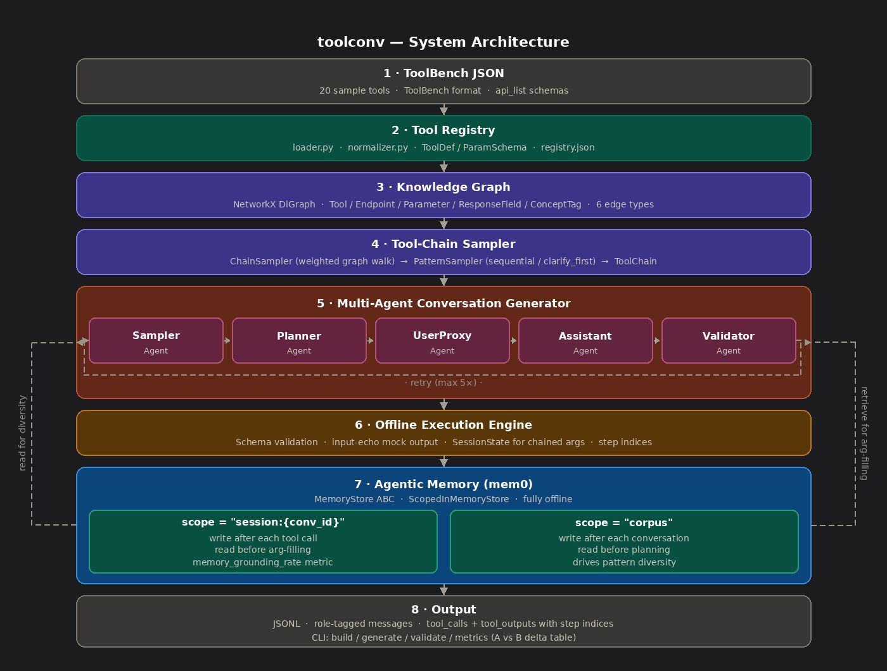

# Design Document — ConvTool

## Overview

ConvTool is an **offline** synthetic data generation system that produces multi-turn, multi-tool conversations grounded in real ToolBench API schemas. It is built to generate training data for tool-use AI agents without requiring any API keys, Docker, or external services.

Two properties are central to the design: **context-aware reasoning** — every argument, scenario, and follow-up is derived from prior tool outputs and schema context rather than generated in isolation and **hallucination reduction** — session memory, sticky parameter propagation, and schema validation collectively prevent the system from fabricating values (IDs, tickers, coordinates) that were already established in earlier steps.

**Pipeline at a glance:**
```
ToolBench JSON → Tool Registry → Knowledge Graph → 2-Layer Sampler
    → Multi-Agent Generator → Offline Execution Engine
        → Agentic Memory (mem0) → JSONL Dataset
```



---

## 1. Tool Registry

**Purpose:** Normalise messy ToolBench JSON files into typed, immutable dataclasses.

- Loader handles **15+ schema inconsistency patterns** (missing fields, wrong types, placeholder bodies, malformed enums) with per-entry exception isolation a single bad endpoint never aborts a full tool file.
- Each tool is stored as a **frozen dataclass** (`Tool`, `Endpoint`, `ParameterSchema`, `ResponseField`), making the registry immutable after load and safe to share across agents.
- Registry serialises to `registry.json` for caching; `get_tool()` / `get_endpoint()` use lazily built dict indices for O(1) lookup.
- Response field extraction follows a 3-level priority: `schema.properties` → `body` → fallback `[{result, status}]`.

---

## 2. Knowledge Graph

**Purpose:** Model relationships between tools, endpoints, parameters, and semantic concepts so the sampler can discover realistic multi-step workflows through graph traversal.

**Node types:** `Tool` · `Endpoint` · `Parameter` · `ResponseField` · `ConceptTag`

**Edge types:**
| Edge | Connects | Meaning |
|---|---|---|
| `HAS_ENDPOINT` | Tool → Endpoint | tool exposes this operation |
| `TAKES_PARAM` | Endpoint → Parameter | operation requires this input |
| `RETURNS_FIELD` | Endpoint → ResponseField | operation produces this output |
| `TAGGED_AS` | Tool → ConceptTag | semantic domain label |
| `CO_OCCURS` | ConceptTag ↔ ConceptTag | tags appear on the same tool |
| `FEEDS` ★ | Endpoint → Endpoint | output field name matches required param name (data-flow) |

**Why NetworkX DiGraph over a graph database:** Runs entirely in-process no infrastructure setup for reviewers. All required traversal operations (`successors()`, `predecessors()`, in-degree queries) are natively supported. For a generation-time artifact that lives only during the process, in-process is the right trade-off.

**FEEDS edges** are the key mechanism: a post-ingestion pass adds `A → B` when any `ResponseField` of A matches a required `Parameter` of B by name. This enables **context-aware chain sampling** the sampler reasons about which endpoints can realistically follow each other based on actual schema-derived data dependencies, not semantic similarity alone (e.g. `geocode` returns `latitude`/`longitude`, which `search_nearby` requires as input).

**Stats (included 43-tool subset):** 3,914 nodes · 4,024 edges · 517 endpoint nodes

---

## 3. Sampler Design

The sampler is intentionally split into two layers so each decision — *which* tools appear and *how* they are structured — can be made independently and tested in isolation.

### Layer 1 — ChainSampler (`graph/sampler.py`)

- Builds a **tool-level projection** of the full graph: one node per tool, edges from `FEEDS` (weight **2.0×**) and shared `ConceptTag` (weight **1.0×**).
- Performs a **weighted random walk** starting from source nodes (in-degree 0 — natural conversation starters).
- At dead ends, falls back to any unvisited same-domain tool to avoid getting stuck.
- A **domain coherence retry loop** rejects walks with domain-mismatched tools and retries up to 5 times.

`FEEDS` edges are weighted 2× because data-flow compatibility is a stronger signal than semantic proximity two tools sharing a concept tag does not imply one should follow the other.

### Layer 2 — PatternSampler (`graph/patterns.py`)

Takes the ordered tool list and assigns a conversation topology:

| Pattern | Structure | Default weight |
|---|---|---|
| `linear` | A→B→C | 30% |
| `pipeline` | A→B→C→D→E | 20% |
| `fan_out` | A→{B, C} independently | 15% |
| `fan_in` | {A, B} independently→C | 15% |
| `conditional` | A→B→C, branch at A | 10% |
| `diamond` | A→{B,C}→D | 10% |

When **corpus memory is enabled**, pattern weights are adjusted dynamically before each sample:
```
adjusted_weight = max(base_weight × avg_usage / (pattern_count + 1), 0.02)
```
Overused patterns are down-weighted; underused ones are boosted producing measurably higher pattern entropy in Run B vs Run A.

---

## 4. Multi-Agent Conversation Generator

Five agents coordinated by `ConversationOrchestrator`:

```
SamplerAgent → PlannerAgent → UserProxyAgent ↔ AssistantAgent → ValidatorAgent
```

| Agent | Responsibility |
|---|---|
| **SamplerAgent** | Calls ChainSampler + PatternSampler, returns a typed `ToolChain` |
| **PlannerAgent** | Infers domain, selects scenario, decides which params are upfront vs. clarified, reads corpus memory |
| **UserProxyAgent** | Generates opening message, clarification replies, and follow-ups from domain templates |
| **AssistantAgent** | Context-aware argument filling (plan → session memory → generation), clarification Qs, result summaries grounded in actual output values |
| **ValidatorAgent** | Checks ≥3 tool calls, ≥2 distinct tools, matching outputs, required params, and explicit chaining |

**Retry:** If validation fails, the orchestrator retries with a modified seed (up to 5 attempts).

**Sticky parameter propagation:** A `conversation_context` dict in the orchestrator carries "sticky" values (symbol, city, date, etc.) across all steps, enabling consistent context-aware reasoning throughout the conversation. This directly reduces hallucination without it, each step would independently generate a new entity value, producing incoherent traces (e.g. `GOOGL` in step 1, a different ticker in step 2) that are unusable as training data.

**API-internal param filtering:** Parameters like `format`, `outputsize`, `language`, `function` are filtered from user-facing messages. A user would never say "the format is json."

---

## 5. Offline Execution Engine

No real APIs are called. The engine (`execution/engine.py`) provides:

- **Schema validation:** checks required parameters are present, types match, and enum constraints are satisfied.
- **Session state enrichment:** resolves missing required parameters from values produced by earlier steps (e.g. `hotel_id` from step 1 auto-fills step 2). This is the execution-layer equivalent of context-aware reasoning the engine carries forward what it already knows rather than allowing hallucinated values to enter the chain.
- **Deterministic mock output:** response field values are derived from `MD5(endpoint_id + args)`. Named fields (`latitude`, `temperature`, `booking_reference`, etc.) get semantically appropriate values. Same inputs always produce the same outputs required for reproducibility at a fixed seed.

---

## 6. Agentic Memory

### MemoryStore Abstraction

```python
class MemoryStore:
    def add(self, content: str, scope: str, metadata: dict) -> None: ...
    def search(self, query: str, scope: str, top_k: int = 5) -> list[dict]: ...
    def reset(self, scope: str) -> None: ...
```

- All agents depend only on this interface never on mem0 directly.
- `make_memory_store()` factory selects the backend automatically:
  - **`Mem0MemoryStore`** — backed by `mem0.Memory()` with in-process Qdrant (no external service).
  - **`InMemoryStore`** — pure-Python keyword search, used in tests and when no API key is present.

### Session Memory (`scope="session"`)

- **Write:** after every tool call — `memory.add(json.dumps(tool_output), scope="session", metadata={conversation_id, step, endpoint})`
- **Read:** before constructing arguments for any non-first tool call — retrieved values ground argument filling in actual prior outputs, enabling context-aware reasoning and reducing hallucination of values (e.g. fabricated booking IDs or incorrect stock symbols) that were already established earlier in the conversation.
- **Metric:** `memory_grounding_rate` = (non-first steps that retrieved ≥1 entry) / (total non-first steps). Value of `1.0` means every eligible step was grounded. `null` if the conversation has only one tool call.

### Corpus Memory (`scope="corpus"`)

- **Write:** after each validated conversation compact summary e.g. `"Tools: alpha_vantage, coinranking. Domain: finance. Pattern: pipeline. Scenario: reviewing portfolio before earnings call."`
- **Read:** before the planner generates a new conversation retrieved summaries steer scenario selection away from already-covered combinations.
- **Disabled with:** `--no-corpus-memory` flag on the `generate` command (used for Run A in the diversity experiment).

---

## 7. Corpus Memory & Diversity Analysis

### Metrics

**Primary — Pairwise Jaccard dissimilarity:**
```
J = 1 - |A ∩ B| / |A ∪ B|    (averaged over all conversation pairs)
```
Measures directly whether different conversations use different tools. A low value means the dataset is dominated by the same tool combinations a training quality problem.

**Secondary — Shannon entropy over pattern-type distribution:**
Measures structural balance. Maximum entropy = all six patterns equally represented. Agents trained only on linear conversations underperform on parallel and conditional tasks.

### Results (seed=42, 55 conversations each)

| Metric | Run A (corpus OFF) | Run B (corpus ON) | Δ |
|---|---|---|---|
| Avg Jaccard dissimilarity | 0.9361 | 0.9402 | **+0.0041** |
| Pattern entropy (bits) | 2.4544 | 2.5299 | **+0.0755** |
| Tool coverage | 0.9767 | 0.9767 | 0 |
| Avg tools / conversation | 3.73 | 3.62 | −0.11 |
| Memory grounding rate | 1.0 | 1.0 | — |

**Pattern distribution shift:**

| Pattern | Run A | Run B |
|---|---|---|
| linear | 30.9% | 23.6% ↓ |
| pipeline | 18.2% | 14.6% ↓ |
| fan_out | 16.4% | 20.0% ↑ |
| fan_in | 9.1% | 16.4% ↑ |
| conditional | 16.4% | 16.4% — |
| diamond | 9.1% | 9.1% — |

### Analysis

Corpus memory produces a **+0.0755 bit improvement in pattern entropy** — the clearest signal of its effect. The mechanism: before each sample, the orchestrator reads accumulated pattern counts from the corpus and passes them to `PatternSampler`, which progressively down-weights overused patterns and boosts underused ones. By conversation 55, `fan_in` has doubled its share (9.1% → 16.4%) while `linear` dropped by 7.3 percentage points.

The Jaccard improvement (+0.0041) is real but modest. Both runs already achieve ~0.94 tool diversity because ChainSampler's weighted graph walk naturally selects different tools each time. Corpus memory's marginal contribution to tool-level diversity is limited at 43 tools — the benefit would be more pronounced at the scale of the full ToolBench registry (16,000+ tools).

The `memory_grounding_rate` of 1.0 in both runs confirms that every eligible non-first tool call successfully retrieved at least one session memory entry — argument filling was fully grounded in prior outputs throughout all 55 conversations.

---

## 8. Design Decisions

| Decision | Rationale |
|---|---|
| Frozen dataclasses for registry | Immutable after load; prevents silent mutation across agents |
| NetworkX DiGraph | In-process, zero setup; all required traversal ops supported |
| FEEDS edges via name matching | Captures most common real dependency patterns without manual annotation |
| MD5-based mock output | Deterministic — same inputs always produce same outputs at any seed |
| Template-based message generation | Fully reproducible offline; no LLM required anywhere in the pipeline |
| Scope-as-user\_id in mem0 | Uses mem0's built-in namespace isolation; session and corpus never mix |
| Sticky parameter propagation | Reduces hallucination — same entity (ticker, city, date) is used consistently across all steps via context-aware propagation |
| Lazy mem0 import | Avoids import-time crash in offline/test environments |
| Retry with modified seed | Pipeline always produces output even when sampling occasionally fails validation |

---

## 9. Future Enhancements

- **LLM-in-the-loop argument filling** — replace static lookup tables with a schema-aware LLM call for more naturalistic parameter values.
- **Embedding-based FEEDS edges** — extend name-match heuristic with semantic similarity to catch equivalent fields with different names (`place_id` vs `location_id`).
- **Negative example generation** — deliberately inject schema violations and recovery conversations for more robust agent training.
- **Registry versioning** — support multiple API versions to generate backwards-compatibility test conversations, relevant in enterprise environments where API lifecycles overlap.
- **Domain-partitioned sampling at scale** — with thousands of tools, pre-partitioning the graph walk by domain before sampling would preserve chain coherence in large registries.
